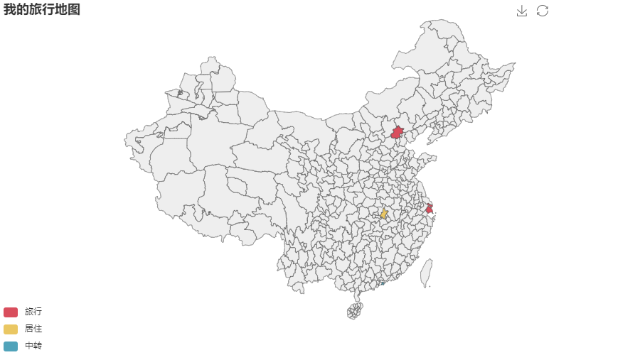

# 旅行地图

这是一个精确到城市旅行地图生成器。
本项目是基于开源项目 [pyechart](https://github.com/pyecharts/pyecharts)，
生成的中国地图符合法律规范。

[](https://github.com/hktkzyx/travel-map/actions/workflows/build_and_test.yml)
[](https://app.codecov.io/gh/hktkzyx/travel-map)
[](https://pypi.org/project/travel-map/)
[](https://github.com/hktkzyx/travel-map/blob/main/LICENSE)
[](https://img.shields.io/pypi/pyversions/travel-map)
[](https://github.com/hktkzyx/travel-map/commits/main)

## 安装

```bash
pip install travel-map
```

## 使用

用户需要将旅行信息输入到一个 CSV 文件里，例如

```csv travelled_cities.csv
城市,组
北京,旅行
上海,旅行
武汉,居住
香港,中转
```

文件中城市的名称可以查阅[文件](https://github.com/pyecharts/pyecharts/blob/d1b2ecd223b6c6d429e698ec690e15bf8c40ae09/pyecharts/datasets/map_filename.json)。

然后运行命令

```bash
travel-map --title "我的旅行地图" --output travel_map.html travelled_cities.csv
```

即可生成标题为`我的旅行地图`的精确到城市的旅行地图如下



## 贡献

如果你想提交你的代码，请先阅读 [CONTRIBUTING.md](CONTRIBUTING.md)。

## 许可证

木兰宽松许可证，第2版 （Mulan Permissive Software License，Version 2）

Copyright (c) 2019 Brooks YUAN

travel-map is licensed under Mulan PSL v2.

You can use this software according to the terms and conditions of the Mulan PSL v2.

You may obtain a copy of Mulan PSL v2 at: <http://license.coscl.org.cn/MulanPSL2>

THIS SOFTWARE IS PROVIDED ON AN "AS IS" BASIS, WITHOUT WARRANTIES OF ANY KIND,
EITHER EXPRESS OR IMPLIED, INCLUDING BUT NOT LIMITED TO NON-INFRINGEMENT,
MERCHANTABILITY OR FIT FOR A PARTICULAR PURPOSE.

See the Mulan PSL v2 for more details.
